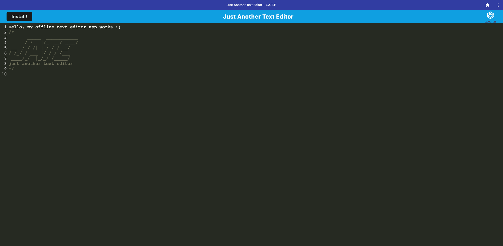

# text-editor1

## Description

This Text Editor app is an installable web-app that you can use without internet connection and use for note-taking.

## Installation

Before use, make you use npm i then npm run start

## Usage

This app willl be helpful in place you where you might not have internet connection and you have a super good ideaaa you want jote down

## Credits

GitHub: https://github.com/a-monroy99
Herooku App: https://jate-text-editor-off-c0963d86290a.herokuapp.com/
